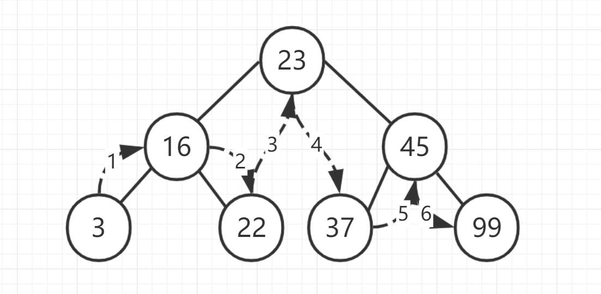

## 前言

本文根据《数据结构与算法JavaScript描述》来写的，相当于个人的读书笔记。

## 树的简介

树是计算机科学中经常用到的数据结构。树是一种非线性的数据结构，以分层的方式存储数据，树由一组以边连接的节点组成，一个节点可以有 0、1 或多个子节点。

## 与树涉及的概念

- **根节点**: 一棵树最上面的节点称为根节点
- **父节点**: 如果一个节点下面连接多个节点，那么该节点称为父节点
- **子节点**: 父节点下面的节点称为子节点
- **叶子节点**: 没有任何子节点的节点称为叶子节点
- **路径**: 从树中一个节点到另一个节点的这一组边称为路径
- **树的遍历**: 以某种特定顺序访问树中所有节点
- **树的深度**: 根节点是第 0 层，以此类推，树的层数就是树的深度

## 二叉树定义

二叉树是一种特殊的树，它的子节点个数不超过两个。二叉树具有一些特殊的计算性质，使得在他们之上的一些操作异常高效。**二叉查找树**是一种特殊的二叉树，相对较小的值保存在左节点中，较大的值保存在右节点中。这一特性使得查找的效率很高。

## JS 模拟二叉查找树

这里主要介绍 BST 的插入方法：

1. 设根节点为当前节点
2. 如果待插入节点保存的数据小于当前节点，则设新的当前节点为原节点的左节点，反之，执行第 4 步
3. 如果当前节点的左节点为 null，就将新的节点插入这个位置，退出循环，反之，继续执行下一个循环
4. 设新的当前节点为原节点的右节点
5. 如果当前节点的右节点为 null，就将新的节点插入这个位置，退出循环，反之，继续执行下一个循环

```js js
class Node {
  constructor(data, left, right) {
    this.data = data;
    this.left = left;
    this.right = right;
  }

  show() {
    return this.data;
  }
}

class BST {
  constructor() {
    this.root = null;
  }

  insert(data) {
    const n = new Node(data, null, null);
    if (this.root === null) {
      return (this.root = n);
    }

    let current = this.root;
    let parent;
    while (true) {
      parent = current;
      if (data < current.data) {
        current = current.left;
        if (current === null) {
          parent.left = n;
          break;
        }
      } else {
        current = current.right;
        if (current === null) {
          parent.right = n;
          break;
        }
      }
    }
  }
}
```

### 遍历二叉树

有三种遍历 BST 的方式: 中序、先序和后序。**中序遍历**按照节点上的键值，以升序访问 BST 上的所有节点。**先序遍历**先访问根节点，然后以同样方式访问左子树和右子树。**后序遍历**先访问叶子节点，从左子树到右子树，再到根节点。

#### 中序遍历



```js js
class BST {
  // ...
  // 左根右
  inOrder(node) {
    if (!(node === null)) {
      inOrder(node.left);
      console.log(node.show() + " ");
      inOrder(node.right);
    }
  }
}
```

#### 先序遍历


```js js
class BST {
  // ...
  // 根左右
  preOrder(node) {
    if (!(node === null)) {
      console.log(node.show() + " ");
      this.preOrder(node.left);
      this.preOrder(node.right);
    }
  }
}
```

#### 后序遍历


```js js
class BST {
  // ...
  // 左右根
  posOrder(node) {
    if (!(node === null)) {
      this.posOrder(node.left);
      this.posOrder(node.right);
      console.log(node.show());
    }
  }
}
```

#### 测试

```js js
const nums = new BST();
nums.insert(23);
nums.insert(45);
nums.insert(16);
nums.insert(37);
nums.insert(3);
nums.insert(99);
nums.insert(21);
nums.insert(5);
nums.insert(20);
nums.insert(22);
nums.inOrder(nums.root); // 3 5 16 20 21 22 23 37 99
nums.preOrder(nums.root); // 23 16 3 5 21 20 22 45 37 99
nums.posOrder(nums.root); // 5 3 20 22 21 16 37 99 45 23
```

## 元素查找

### 查找最大、最小值

```js js
class BST {
  // ...
  getMin() {
    let current = this.root;
    while (!(current.left === null)) {
      current = current.left;
    }
    return current.data;
  }

  getMax() {
    let current = this.root;
    while (!(current.right === null)) {
      current = current.right;
    }
    return current.data;
  }
}
```

### 查找给定值

```js js
class BST {
  // ...
  find(data) {
    let current = this.root;
    while (!(current === null)) {
      if (current.data === data) {
        return current;
      } else if (data < current.data) {
        current = current.left;
      } else {
        current = current.right;
      }
    }
    return null;
  }
}
```

## 元素删除

从 BST 中删除节点的第一步是判断当前节点是否包含待删除的数据，如果包含，则删除该节点；如果不包含，则比较当前节点上的数据与待删除的数据。如果待删除数据小于当前节点的数据，则移至当前节点的左节点继续比较，反之，则移至当前节点的右节点。

如果待删除节点是叶子节点，那么只需要将父节点指向它的链接变成指向 null；如果待删除的节点只包含一个子节点，那么原本指向它的父节点指向它的子节点；如果待删除的节点包含两个子节点，正确的做法有两种，要么查找待删除节点左子树的最大值，要么查找其右子树的最小值，这里代码实现使用后一种方式。查找到最小值后，把最小值赋值到该节点，然后删除右子树的最小值。

```js js
class BST {
  // ...
   getSmallest(node) {
    while (!(node.left === null)) {
      node = node.left;
    }
    return node;
  }

  remove(data) {
    this.root = this.removeNode(this.root, data);
  }

  removeNode(node, data) {
    if (node === null) return null;
    if (data === node.data) {
      // 没有子节点的节点
      if (node.left === null && node.right === null) {
        return null;
      }
      // 没有左节点的节点
      if (node.left === null) {
        return node.right;
      }

      // 没有右节点的节点
      if (node.right === null) {
        return node.left;
      }

      let tempNode = this.getSmallest(node.right);
      node.data = tempNode.data;
      node.right = this.removeNode(node.right, tempNode.data);
      return node;
    } else if (data < node.data) {
      node.left = this.removeNode(node.left, data);
      return node;
    } else {
      node.right = this.removeNode(node.right, data);
      return node;
    }
  }
}
```

## 计数

记录一组数据出现的次数

```js js
class BST {
  constructor(data, left, right) {
    // ...
    this.count = 1;
  }

  update(data) {
    let node = this.find(data);
    node.count++;
    return true;
  }
}
```