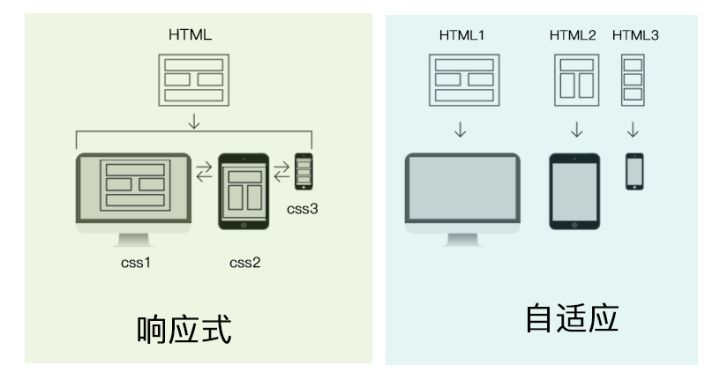

## 前言

因为最近准备面试，同时也为了给自己扫除知识盲区，通过查阅相关资料来阐述一些不懂的知识点，同时结合自己的理解整理出一篇博客，以便温故。

## 一些名词

- 静态布局
- 自适应布局
- 流式布局(百分比布局)
- 响应式布局(媒体查询)
- 弹性布局(rem/em、flex、grid布局)
- 圣杯布局
- 双飞翼布局

## 静态布局

最传统的布局方式，网页中所有尺寸都是由 px 作为单位，设置了 min-width，如果宽度小于最小宽度就会出现滚动条，如果大于这个宽度则内容居中外加背景

## 自适应布局

多个html文件在不同分辨率屏幕显示来达到自适应布局

下面这张图很好的解释了自适应布局与响应式布局的区别



## 流式布局

网页中主要划分区域的尺寸使用百分数，搭配(min-_, max-_)使用，分别为不同的屏幕设置布局格式，当屏幕大小改变时，会出现不同的布局。特点是布局改变，元素不变

## 响应式布局

利用媒体查询可以检测到屏幕的尺寸，并设置不同的 CSS 样式，就可以实现响应式布局

```scss scss
@media screen and(max-width: 767px) {
  // ...
}
```

### 栅格布局

现在许多框架都有自己的栅格布局，但是使用的尺寸大致相同，例如Element定义的尺寸：

- xs: `<768px`, extra small
- sm: `>=768px`, small
- md: `>=992`, medium
- lg: `>=1200`, large
- xl: `>=1920`, extra large

## 弹性布局

利用 rem/em 等方式布局

## 五大布局结论

随着新技术的出现和时代的发展潮流，越来越多的网站舍弃了之前的**不太灵活**的静态布局，而是使用响应式布局，当然很多时候响应式布局会结合弹性布局一起使用，这样网站能够在所有设备上都能很好的展现出来。

## 圣杯布局和双飞翼布局

- 圣杯布局与双飞翼布局都属于三列布局的经典布局
- 它们的效果图一致，但是实现方法不同

### 效果图


### 三栏布局的代码示例

```html html
<header class="header"></header>
<main class="main clearfix">
  <div class="center">中间自适应</div>
  <div class="left"></div>
  <div class="right"></div>
</main>
<footer class="footer"></footer>
```

```scss scss
body {
  padding: 0;
  margin: 0;
}

.header,
.footer {
  height: 100px;
  background-color: purple;
}

// 清除浮动
.clearfix::after {
  content: "";
  display: block;
  clear: both;
}

.left,
.center,
.right {
  height: 500px;
  float: left;
}

.left {
  width: 200px;
  background-color: orange;
  margin-left: -100%; // center在left前面才会有这样的效果
}

.center {
  width: 100%;
  background-color: #eee;
}

.right {
  width: 300px;
  background-color: blueviolet;
  margin-left: -300px;
}
```

效果图：


从效果图可以看出，中间的文字内容没有很好的显示出来，这是因为 left 和 right 两个元素是覆盖在 center 上的，而center的宽度是100%，因此造成了这样的效果，为了解决这一问题，圣杯布局和双飞翼布局使用了不同的方案来解决这一问题

### 圣杯布局方案

给父元素添加一定的 margin，同时给 left 和 right 元素添加定位来使其在合适的位置

```css css
.main {
  margin-left: 200px;
  margin-right: 300px;
}

.left {
  position: relative;
  left: -200px;
}

.right {
  position: relative;
  right: -300px;
}
```

其实目的很简单，通过父元素的 margin 来增加 center 左右边距的距离，同时 left 和 right 元素根据定位补充 center 的空白，这样很好的实现了三栏布局

### 双飞翼布局方案

通过给 center 增加子元素，然后子元素设置一定的外边距来解决上面三栏布局的问题

```html html
<div class="center">
  <div class="inner">
    中间自适应
  </div>
</div>
```

### 最终效果


```css css
.inner {
	margin-left: 200px;
	margin-right: 300px;
}
```

## 参考文章

- [知乎](https://zhuanlan.zhihu.com/p/65517490)
- [知乎-BarryDong](https://zhuanlan.zhihu.com/p/58355168)
