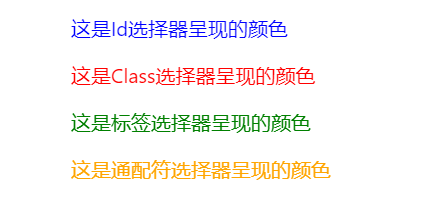

## 前言

总结一下，方便回顾，同时加深印象。

## CSS 选择器

CSS选择器教程中一般是一股脑的都给你，因此我认为需要分分类，这样方便记忆的同时也能快速查阅。本文中的分类是根据[阮一峰的文章](http://www.ruanyifeng.com/blog/2009/03/css_selectors.html)中的分类方法进行的分类

### 基本选择器

- `id`选择器
- `class`选择器
- 标签选择器
- `*`通用元素选择器

例如如下代码：

```html html
<p id="p1">hello</p>
<p class="p2">hello</p>
<p>hello</p>
<span>hello</span>
```

```css css
* {
  color: orange;
}
p {
  color: green;
}
#p1 {
  color: blue;
}
.p2 {
  color: red;
}
```

**最终效果：**



### 多元素组合选择器

一般情况下多元素组合选择器结合`id`、`class`、标签选择器使用

- `A,B`: 同时匹配 A 和 B 元素
- `A B`: 注意 A 与 B 用空格隔开，匹配 A 元素后代中的 B 元素
- `A>B`: 匹配 A 元素子元素中的 B 元素
- `A+B`: 匹配 A 元素后紧接着与 A 同级的 B 元素
- `A~B`: 匹配 A 元素后所有同级的 B 元素

#### A,B

```html html
<style>
  h3,
  p,
  span {
    color: red;
  }
</style>
<h3>hello world</h3>
<p>hello world</p>
<span>hello world</span>
```

**最终效果：**


#### `A B`

因为颜色是可继承的，为了说明选择器确实匹配到了，因此在 span 元素的父元素设置了颜色

```html html
<style>
  div span {
    color: green;
  }
</style>
<div>
  <article>
    <h2 style="color: #000;">
      <span>hello world</span>
    </h2>
  </article>
  <p style="color: #000;">
    <span>hello world</span>
  </p>
</div>
```

**最终效果：**


#### `A>B`

```html html
<style>
  div > span {
    color: green;
  }
</style>
<div>
  <span>hello world</span>
  <p style="color: #000;">
    <span>hello world</span>
  </p>
  <span>hello world</span>
</div>
```

**最终效果：**


#### `A+B`

```html html
<style>
  div + p {
    color: orange;
  }
</style>
<div>
  <p>
    <span>hello world</span>
  </p>
</div>
<p>hello world</p>
<section>
  hello world
  <p>hello world</p>
</section>
<p>hello world</p>
```

**最终效果：**


#### `A~B`

```html html
<style>
  div ~ p {
    color: orange;
  }
</style>
<div>
  <p>
    <span>hello world</span>
  </p>
</div>
<p>hello world</p>
<section>
  hello world
  <p>hello world</p>
</section>
<p>hello world</p>
```

**最终效果：**


### 属性选择器

一般是以外面有中括号`[]`为标志，如果属性值中间没有空格，可以忽略双引号

- `[attr]`: 匹配属性为 attr 的所有元素
- `[attr=val]`: 匹配属性为 attr 且属性值为 val 的所有元素
- `[attr~=val]`: 匹配属性为 attr 且属性值包含 val(这个属性值在这个属性下**必须**是完整的单词，不能是一部分)的所有元素
- `[attr|=val]`: 匹配属性为 attr 且属性值开头为 val(这个开头是有前提的，必须是**连字符**（`-`）的开头)的所有元素
- `[attr^=val]`: 匹配属性为 attr 且属性值开头为 val(这个只要求开头)的所有元素
- `[attr*=val]`: 匹配属性为 attr 且属性值包含 val(这个只需要包含，没有其他限制)的所有元素
- `[attr$=val]`: 匹配属性为 attr 且属性值以 val 结尾的所有元素

```html html
<style>
  [type] {
    color: red;
  }

  [type="submit"] {
    color: green;
  }

  [class~="test"] {
    color: orange;
  }

  [class|="test"] {
    color: purple;
  }

  [class^="h"] {
    color: blueviolet;
  }

  [class*="d"] {
    color: blue;
  }

  [class$="g"] {
    color: pink;
  }
</style>
<button type="button">hello world</button>
<button type="submit">hello world</button>
<p>
  <span class="my test">hello world</span>
  <span class="test">hello world</span>
</p>
<p>
  <span class="hi world">hello world</span>
  <span class="hi">hello world</span>
  <span class="overing">hello world</span>
</p>
```


### 伪类选择器

放到[伪类](#CSS-伪类)讲

### 伪元素

放到[伪元素](#CSS-伪元素)讲

## CSS 伪类

首先，先说明伪类与伪元素的区别，这里借腾讯全端 AlloyTeam 中的[一篇文章](http://www.alloyteam.com/2016/05/summary-of-pseudo-classes-and-pseudo-elements/)进行说明。

> 伪类用于当已有元素处于某个状态时，为其添加对应的样式，这个状态是根据用户的行为而动态变化的。伪元素用于创建一些不在文档中的元素，并为其添加样式。

总的来说，伪类是依靠现有元素，伪元素是依靠自己新创建的元素。

在 CSS3 之前无论伪类还是伪元素都是使用单冒号`:`来使用，但是 CSS3 为了区分两者的区别，规定使用双冒号`::`来表示伪元素，单冒号`:`表示伪类

### 伪类具体用法

一图胜千言，来自腾讯全端 AlloyTeam中的文章


#### 语言相关

- `:dir`(实验阶段): 指定元素的阅读方向，并且元素需要设置 dir 属性时才会生效
- `:lang`: 基于语言匹配页面元素

#### 表单相关

- `:checked`: 匹配选中状态的radio(`<input type="radio">`)、checkbox(`<input type="checkbox">`)和select元素中的option
- `:default`: 匹配默认选中的元素，该选择器在`button`、`<input type="checkbox">`、`<input type="radio">`和`<option>`上使用
- `:empty`: 代表没有子元素的元素，子元素可以是元素节点或文本(空格)，因此中间是空格也不能匹配
- `:disabled`: 匹配任何被禁用的元素，一般表现于表单加上`disabled`属性
- `:enabled`: 表示任何激活状态的元素，一般匹配那些没有加`disabled`属性的表单元素
- `:in-range`: 匹配有min和max属性限定取值范围的且在取值在限定范围之内的表单元素
- `:out-of-range`: 匹配有min和max属性限定取值范围的且在取值在限定范围之外的表单元素
- `:indeterminate`: 表示状态不确定的表单元素，有三种: 一是`<input type="checkbox">`元素，其` indeterminate`属性被JS设置成true；二是`<input type="radio">`元素，表单中拥有相同的`name`值的所有单选按钮都未被选中时，三是处于不确定状态的`<progress>`元素
- `:valid`: 匹配条件正确的表单元素，例如`email`设置的规则
- `:invalid`: 匹配条件错误的表单元素
- `:optional`: 匹配没有设置`required`属性的表单元素
- `:required`: 匹配设置了`required`属性的表单元素
- `:read-only`: 匹配设置了`readonly`属性的表单元素，定义元素只读
- `:read-write`: 匹配处于编辑状态的元素，`input`、`textarea`和设置了`contenteditable`的HTMl元素获得焦点时匹配
- `:scope`(实验阶段): 处于style作用域下的元素

#### 状态相关

一般状态想关伪类的顺序是`:link`-`:visited`-`:hover`-`:active`

- `:link`: 选中所有未访问过的链接
- `:visited`: 选中所有访问过的链接
- `:hover`: 表示用户鼠标悬停在某元素的时候
- `:active`: 它代表用户按下按键和松开按键之间的时间，因该伪类易被其他伪类覆盖，因此在声明的时候把`:active`放到最后
- `:focus`: 表示获得焦点的元素(如表单输入时改变颜色或者状态等)
- `:focus-within`: 匹配该元素或者该元素后代获得焦点的时候

#### 结构化

- `:not`: 用来匹配不符合一组选择器的元素，例如`:not(:first-child)`、`:not(.list)`
- `:first-child`: 匹配元素的第一个子元素
- `:last-child`: 匹配元素的最后一个子元素
- `:first-of-type`: 匹配元素后代元素中的第一个出现的后代元素，看下面的例子
- `:last-of-type`: 匹配元素后代元素中最后一个出现的后代元素
- `:nth-child`: 根据元素的位置匹配一个或者多个元素，接收`an+b`形式的参数
- `:nth-last-child`: 语法与`:nth-child`，但是`:nth-child`是从前往后计，而`:nth-last-child`是从后往前计
- `:nth-of-type`: 匹配特定的文本，用法与`:nth-child`相同
- `:nth-last-of-type`: 从后往前匹配特定的文本
- `:only-child`: 匹配没有任何兄弟节点的节点，等同于`:first-child:last-child`或者`:nth-child(1):nth-last-child(1)`
- `:only-of-type`: 匹配没有相同兄弟类型节点的节点
- `:target`: 在id与页面url中`#`后面元素相匹配时发生作用，例如url为了`https://www.example.com/index#section`，那么使用id为`section`同时使用`:target`能够匹配到该url时的状态

1. `:first-of-type` & `:last-of-type`

```html html
<style>
  /* 注意ul与伪类间的空格 */
  ul :first-of-type {
    color: orange;
  }
</style>
<ul>
  <li>这里的文本是橙色的</li>
  <li>一些文本 <span>这里的文本是橙色的</span></li>
  <li>一些文本</li>
</ul>
```

```html html
<style>
  /* 注意ul与伪类间的空格 */
  ul :last-of-type {
    color: red;
  }
</style>
<ul>
  <li>一些文本</li>
  <li>一些文本 <span>这里的文本是红色的</span></li>
  <li>这里的文本是红色的</li>
</ul>
```

2. `:nth-child`

举例说明匹配的规则

- `:nth-child(1)`: 匹配第一个子元素，主要从1开始而不是0
- `:nth-child(n)`: 匹配每一个元素
- `:nth-child(2n)`: 匹配位置为2、4、6...等子元素，可以用`even`替换
- `:nth-child(2n+1)`: 匹配位置为1、3、5...等子元素，可以用`odd`替换
- `:nth-child(3n+4)`: 匹配位置为4、7、10...等子元素

3. `:nth-of-type`

```html html
<style>
  p:nth-of-type(2n+1) {
    color: red;
  }
</style>
<div>
	<div>123</div>
	<p>这里的文本是红色的</p>
	<div>123</div>
	<p>123</p>
	<p>这里的文本是红色的</p>
</div>
```

#### 打印相关

- `:left`: 表示打印文档的左侧页设置CSS样式，配合@使用例如:`@page :left {}`
- `:right`: 表示文档的右侧页设置CSS样式

#### 其他

- `:root`: 匹配文档的根元素，对于 HTML 来说，与`html`标签选择器相同
- `:fullscreen`(实验阶段): 匹配全屏模式下的元素

## CSS 伪元素

一图胜千言，来自腾讯全端 AlloyTeam中的文章


伪元素相对于伪类来说少很多

### 单双冒号都可

- `::before`: 创建一个伪元素，其将成为匹配选中的第一个子元素，常用content属性为一个元素添加修饰性的内容，默认生成行内元素
- `:after`: 创建一个伪元素，作为匹配选中的最后一个子元素，配合content属性使用
- `:first-letter`: 选中**块级元素**第一行的第一个字母，并且文字所在行之前没有其他内容(图片或者内联的表格)
- `:first-line`: 匹配**块级元素**中第一行文本，display为block、inline-block、table-cell、table-caption有用

### 仅双冒号

- `::selection`: 应用文档中被用户高亮的部分，例如鼠标选中的文字
- `::cue`: 用于匹配所选元素中的WebVTT提示，就是匹配视频、音频中的字母文件
- `::placeholder`: 匹配表单中设置placeholder元素中的文字部分
- `::backdrop`: 改变全屏模式下的背景颜色

## 参考文章

- [阮一峰的网络日志](http://www.ruanyifeng.com/blog/2009/03/css_selectors.html)
- [腾讯 AlloyTeam](http://www.alloyteam.com/2016/05/summary-of-pseudo-classes-and-pseudo-elements/)
