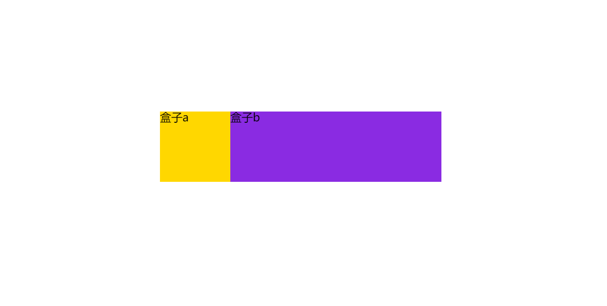

```pug
.box
	.box_a 盒子a
	.box_b 盒子b
```

```less
.box {
	display: flex;
	width: 400px;
	height: 100px;
	
	&_a {
		width: 40px;
		background-color: gold;
	}
	
	&_b {
		flex: 1;
		background-color: blueviolet;
	}
}
```



