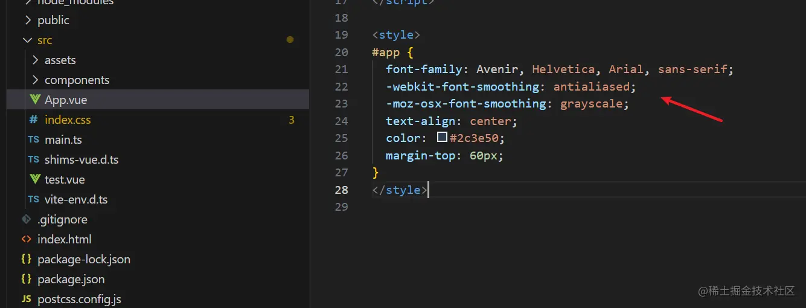
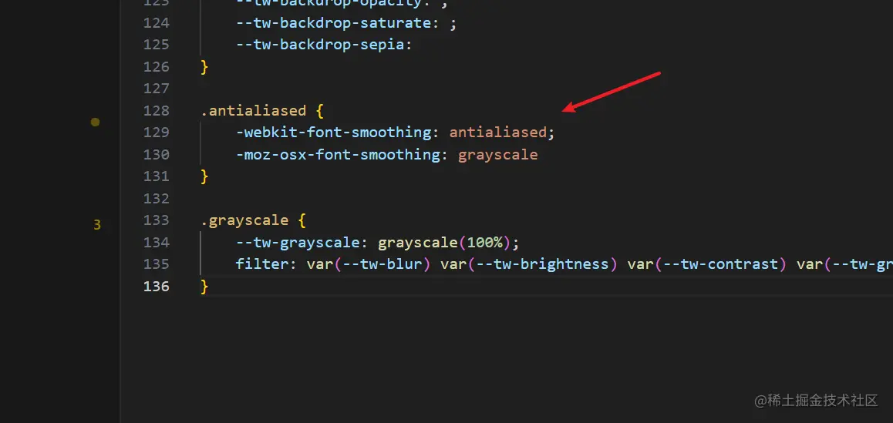
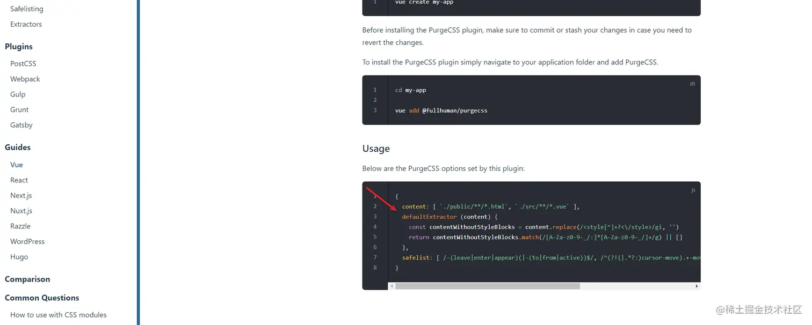
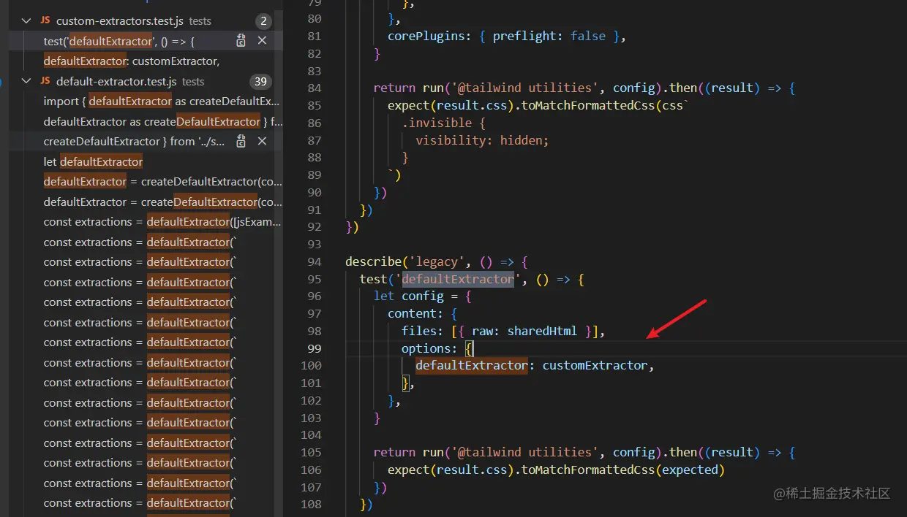
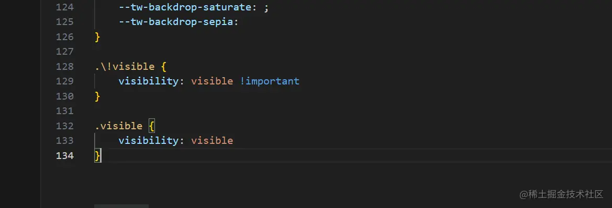

## 背景

目前接触到一个项目，它是由 [@efox/emp](https://link.juejin.cn/?target=https%3A%2F%2Femp2.netlify.app%2F) 搭建的，最近在开发的项目中考虑引入原子化CSS。

## 选型

我之前接触过两种原子化框架，[tailwindcss](https://link.juejin.cn/?target=https%3A%2F%2Ftailwindcss.com%2F) 和 [windicss](https://link.juejin.cn/?target=https%3A%2F%2Fwindicss.org%2F)，这次考虑到 `windicss` 原作者已经不再维护相关库了同时我又想尝试新的框架，因此选了 [unocss](https://link.juejin.cn/?target=https%3A%2F%2Funocss.dev%2F)

## unocss 配置

根据 `@efox/emp` 相关介绍来说是基于 `webpack5`，因此我安装的时候采用了 [Webpack Plugin](https://link.juejin.cn/?target=https%3A%2F%2Funocss.dev%2Fintegrations%2Fwebpack) 安装的相关步骤，但是最终启动的时候出现了内部依赖的各项报错，然后找 `issue`、`stackoverflow` 等都没有找到相应的解决方案，所以不知道是我配置的问题还是框架依赖存在问题，总而言之，最后无奈放弃了这种解决方案

PS：如果有人可以提供一个简单解决的 `demo` 感激不尽

我又找了一下是否有其他方式，本来想使用 [Postcss Plugin](https://link.juejin.cn/?target=https%3A%2F%2Funocss.dev%2Fintegrations%2Fpostcss)，但看到其中写着一个告警

> WARNING
>
> This package is in an experimental state right now. It doesn't follow semver, and may introduce breaking changes in patch versions.

因此为了稳定性，放弃了引入 `unocss`，转向 `tailwind`

## tailwind

### 配置

我认为 `tailwind` 的配置还是比较简单的，直接按照官网的安装步骤走就可以

### 多余样式
打完包后其实想看是否按需加载的，通过代码搜索看到确实进行了按需加载，但是也生成了一些没有用到过的样式，搜了一下发现在 `vue` 中的 `style` 内其实有 `position: absolute`，打包出来存在没用到的 `.absolute { position: absolute }`，因此怀疑是 `vue` 中的 `style` 影响到读取并生成了多余样式，我于是初始化一个最简单的模板进行了测试，使用的是 `Vite` 生成的模板

打包前存在的样式：



打包后生成的样式：



### 解决方案一

发现果然如我所想，因此我自然而然的想到在读取的时候有没有一种措施能够忽略掉 style 内的样式，于是找了一下 `tailwind` 是使用哪个工具来扫描文件的，最终发现是 [@fullhuman/postcss-purgecss](https://link.juejin.cn/?target=https%3A%2F%2Fgithub.com%2FFullHuman%2Fpurgecss)，然后找了官网发现了一个解决措施



于是兴冲冲地去找了 `tailwind` 配置项，这里说一个小技巧，如果不知道如何配置那么可以找这个工具仓库的 `tests` 文件，这些文件是用于自测使用，但可以通过这些测试案例很好的了解到如何配置

这个通过 `defaultExtractor` 这个配置项找到了如何配置



于是写下来如下解决方案，在 `tailwind.config.js` 中配置：

```js
/** @type {import('tailwindcss').Config} */
const customExtractor = (content) => {
  const contentWithoutStyleBlocks = content.replace(/<style[^]+?<\/style>/gi, '')
  return contentWithoutStyleBlocks.match(/[A-Za-z0-9-_/:]*[A-Za-z0-9-_/]+/g) || []
}
module.exports = {
  corePlugins: {
    preflight: false,
  },
  content: {
    relative: true,
    files: ["./src/**/*.{html,js,vue,ts}"],
    options: {
      defaultExtractor: customExtractor,
    }
  },
}
```

结果发现并没有生效，然后通过测试发现传参进来的 `content` 是文件内的单行，并不是整个文件，因此并不能解决这个问题，因此该方法失败

然后思考是否有配置项可以整个文件进行读取，找了 `api` 发现有一个 transform 选项可以做到，于是我又在 `tailwind.config.js` 进行如下配置：

```js
/** @type {import('tailwindcss').Config} */
const customTransformer = (content) => {
  const contentWithoutStyleBlocks = content.replace(/<style[^]+?<\/style>/gi, '')
  return contentWithoutStyleBlocks
}
module.exports = {
  corePlugins: {
    preflight: false,
  },
  content: {
    relative: true,
    files: ["./src/**/*.{html,js,vue,ts}"],
    transform: {
      vue: customTransformer,
    }
  },
}
```

经过测试发现确实可以忽略 `style` 内的样式，但是又发现还是存在多余的样式，然后经过测试发现原来 `vue` 中定义的变量也会被读取，例如：

```vue
const visible = ref(false)

const changeVisible = () => {
  visible.value = !visible.value
}
```

那么在最终生成打包出来的样式就会存在冗余，如下图所示：



在`js`、`ts`文件中如果出现变量值或者函数名存在与 `tailwind` 一致，并且这种情况很难用规避，那么打包后不可避免的就会产生多余的样式，但这种情况应该也不会很多，个人认为在可接受范围内

### 解决方案二

方案一虽然可接受，但没能很好的解决多余样式问题，于是我又想到是否还有其他的解决方案，思考后想到可以通过添加前缀的方式来解决，这样基本可以避免重复问题，于是有了如下配置：

```js
/** @type {import('tailwindcss').Config} */
module.exports = {
  prefix: 'tw-',
  corePlugins: {
    preflight: false,
  },
  content: ["./src/**/*.{html,js,vue,ts}"],
}
```

这样在书写的时候虽然多了前缀，但这样基本可以避免其他命名的冲突，很好地解决生成多余样式问题

## 总结

在以往的开发过程中都是能使用就行，并没有关注过打包后是否会存在问题，这一次原先是想看是否按需加载，却意外发现生成多余样式，然后根据这个问题去解决的心路历程。
