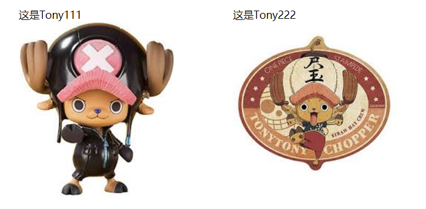

## 前言

这是一篇巩固知识点的博客，**问**: HTML5新增的标签及用法？

## 图形相关

- canvas: 相当于一块画布，可以让开发者利用相关API实现自由画图
- picture: 定义一组图片用于不同分辨率下显示
- svg: 能够绘制矢量图

### canvas

之前一篇[博客](/canvas基础.html)就介绍过Canvas的用法与实例

### picture

在下面的代码中根据屏幕的分辨率来显示不同的图片，同时只会加载该分辨率下的图片，这很好的解决了img在display为none的情况下还是会发出请求的问题

```html html
<picture>
  <source media="(min-width: 650px)" srcset="img_pink_flowers.jpg">
  <source media="(min-width: 465px)" srcset="img_white_flower.jpg">
  
</picture>
```

#### source的属性

- srcset(src): 定义图片的资源路径(定义video和audio)
- media: 定义分辨率大小
- sizes: 定义需要加载多大像素的图片，具体用法可以看[拓展](#拓展)部分
- type: 定义资源格式

### svg

svg有专门的语法，需要用到时再学习，这里先展示其一个例子

```html html
<svg width="100" height="100">
  <circle cx="50" cy="50" r="40" stroke="green" stroke-width="4" fill="yellow" />
</svg>
```

## 多媒体元素

- audio: 音频
- video: 视频
- source: 定义多种格式的音频、视频、图片等资源
- track: 用于音频或视频的文本文件引用
- embed: 嵌入外部应用或flash

### audio & video

这两个元素的使用在之前的[博客](https://zjgyb.github.io/HTML5%E8%84%9A%E6%9C%AC%E7%BC%96%E7%A8%8B.html)中介绍过

### source

定义多媒体资源，当不确定浏览器是否支持一种格式的视频资源并且有多个多媒体资源的时候使用

```html html
<video id="myvideo">
  <source src="conference.webm" type="video/webm; codecs='vp8, vorbis'" />
  <source src="conference.ogv" type="video/ogg; codecs='theora, vorbis'" />
  <source src="conference.mpg" />
  Video player not available.
</video>
```

### track

用于规定字幕文件或其他包含文本的文件，当媒体播放时，这些文件是可见的，一般在 audio 和 video 内部，例如来自[MDN](https://developer.mozilla.org/en-US/docs/Web/HTML/Element/track)的例子

```html html
<video controls width="250" src="/media/examples/friday.mp4">
  <track
    default
    kind="captions"
    srclang="en"
    src="/media/examples/friday.vtt"
  />
  Sorry, your browser doesn't support embedded videos.
</video>
```

### embed

标签定义了一个容器，用来嵌入外部应用或者互动程序，例如 flash

```html html
<embed src="hello_world.swf" />
```

## 新表单元素

- datalist
- output
- keygen(已废弃)

### datalist

定义了一个 input 中可能的下拉元素，同时也可手动输入，类似于下拉框结合一个输入框

```html html
<input list="browsers" />
<datalist id="browsers">
  <option value="IE"> </option>
  <option value="Chrome"> </option>
  <option value="Firefox"> </option>
  <option value="Safari"> </option>
  <option value="Edge"> </option>
</datalist>
```

### output

表单通过计算或者展示的结果放入 output 中，例如 MDN 的[例子](https://developer.mozilla.org/en-US/docs/Web/HTML/Element/output)

```html html
<form oninput="result.value=parseInt(a.value)+parseInt(b.value)">
  <input type="range" id="b" name="b" value="50" /> +
  <input type="number" id="a" name="a" value="10" /> =
  <output name="result" for="a b">60</output>
</form>
```

## 新的语义和结构元素

- article: 定义页面独立的内容区域
- section: 定义文档中的节
- header: 定义文档的头部区域
- nav: 定义导航链接的部分
- aside: 定义页面的**侧边栏**
- main: 定义文档的主要内容
- footer: 定义 section 或 document 的页脚
- dialog: 定义对话框，可以当一个标签使用
- figure: 规定独立的流内容(图像、图标、照片、代码等)
- figcaption: 定义 figure 元素的标题
- mark: 高亮显示文本，背景色是 yellow
- meter: 展示给定的数据范围
- progress: 定义任务进度
- wbr: 在合适的地方添加换行符
- ruby、rt、rp: 定义 ruby 注释、定义字符的解释或发音、定义不支持 ruby 元素的浏览器显示的内容
- time: 给机器识别的标签
- bdi: 允许您设置一段文本，使其脱离其父元素的文本方向设置。
- command(没有浏览器支持)
- details, summary: 用于描述文档或文档某个部分的细节、文档的标题，summary用于展示，点击之后会展开details内的内容

### article & section

这两个区别比较困难通过查阅相关的资料，总的来说：

- article: 代表文档、页面或应用程序中**独立的**、**完整的**、可以独自被外界引用的内容
- section: 用于对网站或应用程序中页面上的内容进行**分块**

section 使用的禁忌：

1. 不要将它作为设置样式的页面容器，应使用 div
2. 如果其他的元素 nav、header、footer 更合适，那就不要使用 section
3. 不要为没有标题的内容块使用 section

### `<main>`

**注意**：main是独一无二的，因此一个文档中只能有一个main，同时main不应该在article、aside、footer、header、nav等标签内

### figure & figcaption

例如菜鸟教程的[例子](https://www.runoob.com/tags/tag-figcaption.html)

```html html
<figure>
  
  <figcaption>Fig.1 - A view of the pulpit rock in Norway.</figcaption>
</figure>
```

### detail & summary

例如下面来自[菜鸟教程](https://www.runoob.com/tags/tag-summary.html)中的例子：

```html html
<details>
  <summary>Copyright 1999-2011.</summary>
  <p> - by Refsnes Data. All Rights Reserved.</p>
  <p>All content and graphics on this web site are the property of the company Refsnes Data.</p>
</details>
```

### meter & progress

这两个元素在显示于语法上有点类似

```html html
<meter value="0.6">60%</meter> <progress value="22" max="100"></progress>
```

### wbr

当页面不足以一行显示下面字段时，`HTTP`会与后面的`Request`换行

```html html
<p>学习 AJAX ,您必须熟悉 <wbr />Http<wbr />Request 对象。</p>
```

### ruby、rp、rt

```html html
<ruby>
  汉 <rp>(</rp><rt>Han</rt><rp>)</rp> 字 <rp>(</rp><rt>zi</rt><rp>)</rp>
</ruby>
```

## 拓展

之前对img内的属性srcset和sizes这两个属性不是特别理解，因此，通过查阅相关的资料，对这两个属性进行说明

### srcset

`srcset`是一个包含一个或多个源图的容器，不同源图用逗号分隔，每一个源图由两部分组成：

1. 图片的URL
2. `x`(设备像素比)或`w`图片像素宽度描述，`w`描述符的加载策略是通过`sizes`属性的声明来计算选择的，如果没有给出，默认是`1x`

先说`x`，`x`代表设备像素比，那什么是设备像素比(DPR)呢？设备像素比 = 分辨率 / 设备独立像素，从这篇[文章](https://learnku.com/articles/7309/what-is-the-independent-pixel-resolution-and-device-pixel-of-the-device-for-a-mobile-phone)可以简单的了解三个概念: 设备独立像素、分辨率、设备像素比，如果你想获知设备的像素比，可以使用`window.devicePixelRatio`这个API获取，一般设备像素比为`1~5`之间，通过测试，我的联想小新700电脑是`1.25`，我的小米6手机的设备像素比是`3`，这样你就能够清楚当设置不同的像素比时显示不同的图片了，在举例之前，先说明两种图片对应的名字：tony111对应`tony1.jpg`，tony222对应`tony2.jpg`



代码示例：

```html html

```

在电脑上会显示tony111，因为电脑的设备像素比为`1.25`，同时取值时会忽略后面的小数，所以取1，而在我的手机上显示的是tony222，因为手机的设备像素比为3，更接近2，所以会显示tony222

**注意点**

1. 书写的时候需要从小到大向右书写，否则前面比后面大的话永远显示前面的图片，后面的就会忽略。例如下面的代码永远显示tony111

```html html

```

2. 如果找不到对应的像素，那么一般会寻找比它大且最接近的设备像素比，若还是找不到，则会找比它小且最接近的设备像素比，但是会对图片进行放大或缩小(**不同浏览器策略可能不同，我用Chrome测是这样的**)。例如电脑端的图片会找到tony111显示，同时显示的tony111大小会比设置`1x`下缩小1倍

```html html

```

### sizes

只对设置`srcset`中的`w`起作用，所以两种结合起来使用。例如下面的例子，在我的PC上显示tony222，为什么呢？因为根据sizes设置的规则，我的电脑大于768px的，因此使用600px，同时电脑的设备像素比为1，因此`600 * 1 = 600px`对应的是tony222，而我的手机为360px，同时设备像素比为3，因此`128 * 3 = 384px`对应的是tony111

```html html

```

但是如果计算的数值与其他图片像素差距太大，浏览器取图片时极不规律，看如下的例子你会发现，无论手机还是移动端显示的都是tony222，计算一下`384 - 246 = 138`、`600 - 384 = 216`，`384 - 211 = 173`、`700 - 384 = 316`取得不规律

```html html
<!-- 取tony2 -->

<!-- 取tony1 -->


<!--  取tony2 -->

<!-- 取tony1 -->

```

### 总结

在同时使用sizes和srcset的时候注意选择哪个值极不规律，因此应提前计算大概的值以便显示自己需要的值

## 参考教程

- [张鑫旭的博客](https://www.zhangxinxu.com/wordpress/2014/10/responsive-images-srcset-size-w-descriptor/)
- [简书](https://www.jianshu.com/p/607567e488fc)
- [w3schools](https://www.w3schools.com/html/html5_new_elements.asp)
