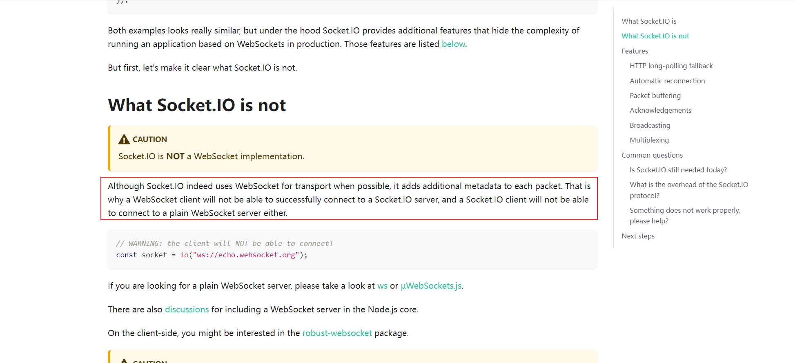

## 背景

1. 产品通信方式改为`WebSocket`
2. 后端使用原生写
3. 目前业务只接收信息

拿到需求的时候马上想到了`socket.io`库，因此没想太多就测试使用了，但是测试发现一直连接失败，debugger一天一直没解决，后来才从`socket.io`文档上发现了问题，害，以后得好好看文档。



根据`socket.io`推荐的客户端封装[robust-websocket](https://github.com/nathanboktae/robust-websocket)已经好久没有更新了，同时该库使用`ES5`写法，不符合当前要求，因此决定自己封装一个。

## 封装

目前的需求其实就是前端接收信息即可，因此就做了简单的封装，以下是封装时考虑到的几点：

1. 实现发布订阅功能
2. 支持单例
3. 连接时存在超时时间
4. 支持断开重连并且支持配置重连次数

其中部分API参考了`socket.io`

### 基础模板

询问`chatGPT`可以得到初始模板

```ts
interface WebSocketOptions {
  url: string;
  timeout?: number;
  reconnectTimes?: number;
}

type WebSocketEvent = 'open' | 'close' | 'message' | 'error';

class WebSocketClient {
  private static instance: WebSocketClient;
  private ws: WebSocket | null = null;
  private url: string;
  private timeout: number;
  private reconnectTimes: number;
  private eventListeners: Map<WebSocketEvent, Set<Function>> = new Map();

  private constructor(options: WebSocketOptions) {
    this.url = options.url;
    this.timeout = options.timeout || 5000;
    this.reconnectTimes = options.reconnectTimes || 3;
    this.connect();
  }

  public static getInstance(options: WebSocketOptions): WebSocketClient {
    if (!WebSocketClient.instance) {
      WebSocketClient.instance = new WebSocketClient(options);
    }
    return WebSocketClient.instance;
  }

  public on(event: WebSocketEvent, listener: Function): void {
    if (!this.eventListeners.has(event)) {
      this.eventListeners.set(event, new Set());
    }
    this.eventListeners.get(event)?.add(listener);
  }

  public off(event: WebSocketEvent, listener: Function): void {
    if (this.eventListeners.has(event)) {
      this.eventListeners.get(event)?.delete(listener);
    }
  }

  public emit(event: WebSocketEvent, data: any): void {
    if (this.ws && this.ws.readyState === WebSocket.OPEN) {
      this.ws.send(JSON.stringify({ event, data }));
    }
  }

  private connect(): void {
    this.ws = new WebSocket(this.url);
    this.ws.onopen = () => {
      this.eventListeners.get('open')?.forEach((listener) => listener());
    };
    this.ws.onclose = () => {
      this.eventListeners.get('close')?.forEach((listener) => listener());
      if (this.reconnectTimes > 0) {
        this.reconnectTimes--;
        setTimeout(() => this.connect(), this.timeout);
      }
    };
    this.ws.onmessage = (event) => {
      const { event: eventName, data } = JSON.parse(event.data);
      this.eventListeners.get(eventName)?.forEach((listener) => listener(data));
    };
    this.ws.onerror = () => {
      this.eventListeners.get('error')?.forEach((listener) => listener());
    };
  }
}
```

### 发布订阅功能

```ts
interface ClientOptions {
    autoConnect: boolean;
    protocols?: string[];
}

type EventFunc = (event: any) => void;

const enum WebSocketEventEnum {
    open = 'open',
    close = 'close',
    error = 'error',
    message = 'message'
}

const getDefaultOptions = (): ClientOptions => ({
    autoConnect: true
});

const getEmptyEventsMap = (): Record<WebSocketEventEnum, EventFunc[]> => ({
    [WebSocketEventEnum.open]: [],
    [WebSocketEventEnum.close]: [],
    [WebSocketEventEnum.error]: [],
    [WebSocketEventEnum.message]: [],
});

class WebsocketClient {
    private url: string;
    private options: ClientOptions;
    private websocket: WebSocket | null;
    private events = getEmptyEventsMap();

    constructor(url: string, options: Partial<ClientOptions>) {
        this.url = url;
        this.options = {
            ...getDefaultOptions(),
            ...options
        };

        if (this.options.autoConnect) {
            this.connect();
        }
    }

    public connect() {
        this.websocket = new WebSocket(this.url, this.options.protocols);

        this.websocket.onopen = (event) => {
            this.emit(WebSocketEventEnum.open, event);
        }

        this.websocket.onmessage = (event) => {
            this.emit(WebSocketEventEnum.message, event);
        }

        this.websocket.onerror = (event) => {
            this.emit(WebSocketEventEnum.error, event);
        }

        this.websocket.onclose = (event) => {
            this.emit(WebSocketEventEnum.close, event);
        }
    }

    public on(name: WebSocketEventEnum, listener: EventFunc) {
        this.events[name].push(listener);
    }

    public off(name?: WebSocketEventEnum, listener?: EventFunc) {
        if (!name) {
            this.events = getEmptyEventsMap();
            return;
        }

        if (!listener) {
            this.events[name] = [];
            return;
        }

        const index = this.events[name].findIndex(fn => fn === listener);
        if (index > -1) {
            this.events[name].splice(index, 1);
        }
    }

    public send (data: string | ArrayBuffer | SharedArrayBuffer | Blob | ArrayBufferView) {
        if (this.websocket?.readyState === WebSocket.OPEN) {
            this.websocket.send(data);
        }
    }

    private emit(name: WebSocketEventEnum, event: any) {
        this.events[name].forEach(listener => listener(event));
    }
}
```

### 支持单例

考虑到如果某一个websocket状态如果与某一个文件强关联那么可以把事件直接注册到那个文件中，为了避免创建多个实例，所以考虑加一个单例功能

```ts
class WebSocketClient {
    private static instance: WebsocketClient | null = null;

    public static getInstance(url: string, options: Partial<ClientOptions> = {}) {
        if (!WebsocketClient.instance) {
            WebsocketClient.instance = new WebsocketClient(url, options);
        }
        return WebsocketClient.instance;
    }
}
```

### 设置超时时间

```ts
interface ClientOptions {
    // ...
    timeout: number;
}

const getDefaultOptions = (): ClientOptions => ({
    // ...
    timeout: 20_000,
});

class WebSocketClient {
    public connect() {
        this.websocket = new WebSocket(this.url, this.options.protocols);
        this.setTimer();

        this.websocket.onopen = (event) => {
            this.clearTimer();
            this.emit(WebSocketEventEnum.open, event);
        }

        // ...
    }

    private setTimer() {
        this.clearTimer();
        this.timer = setTimeout(() => {

            // 疑问1
            this.websocket?.close();
        }, this.options.timeout);
    }

    private clearTimer() {
        this.timer !== null && clearTimeout(this.timer);
    }
}
```

### 断开重连

```ts
interface ClientOptions {
    // ...
    reconnectionAttempts: number;
    reconnectionDelay: number;
}

const enum WebSocketEventEnum {
    // ...
    reconnectAttempt = 'reconnectAttempt',
    reconnectFailed = 'reconnectFailed'
}

const getDefaultOptions = (): ClientOptions => ({
    // ...
    reconnectionAttempts: Infinity,
    reconnectionDelay: 5_000,
});

class WebSocketClient {
    private reconnectionAttempts = 0;

    public connect(resetReconnectionAttempts = true) {

        // 手动调用默认重置重连，但是内部调用不需要清空
        if (resetReconnectionAttempts) {
            this.reconnectionAttempts = 0;
        }

        // ...

        this.websocket.onerror = (event) => {
            this.emit(WebSocketEventEnum.error, event);
            this.reconnect(event);
        }

        this.websocket.onclose = (event) => {
            this.emit(WebSocketEventEnum.close, event);
            this.reconnect(event);
        }
    }

    public disconnect() {
        this.reconnectionAttempts = -1;
        this.websocket?.close(1_000, 'Normal Closure');
    }

    private reconnect (event: Event) {

        // -1时不需要重连
        if (this.reconnectionAttempts === -1) {
            this.websocket = null;
            return;
        }

        // 疑问2
        if (this.websocket?.readyState !== WebSocket.CLOSED) {
            return;
        }

        this.websocket = null;
        this.reconnectionAttempts++;
        this.emit(WebSocketEventEnum.reconnectAttempt, this.reconnectionAttempts);
        if (!Number.isFinite(this.options.reconnectionAttempts) || this.reconnectionAttempts <= this.options.reconnectionAttempts) {
            setTimeout(() => {
                this.connect(false);
            }, this.options.reconnectionDelay);
            return;
        }

        this.emit(WebSocketEventEnum.reconnectFailed, event);
    }
}
```

### 其他

其实还可以增加`once`功能，只触发一次，这里的逻辑和on类似，因此不再列举

## 问题

在上面的代码中引申出两个问题

### 疑问1

在超时时间中我直接使用了`this.websocket?.close()`，根据[MDN](https://developer.mozilla.org/en-US/docs/Web/API/WebSocket/close)中的语法来说存在`code`和`reason`

1. 默认打印出的`code`和`reason`是什么
2. 如果我在代码中手动赋值，那么打印出的`code`和`reason`是什么，是默认值还是手动赋的值

### 疑问2

1. 如果我直接设置`this.websocket = null`不加前面的判断会出现什么结果

**下一篇解答，敬请期待...**
