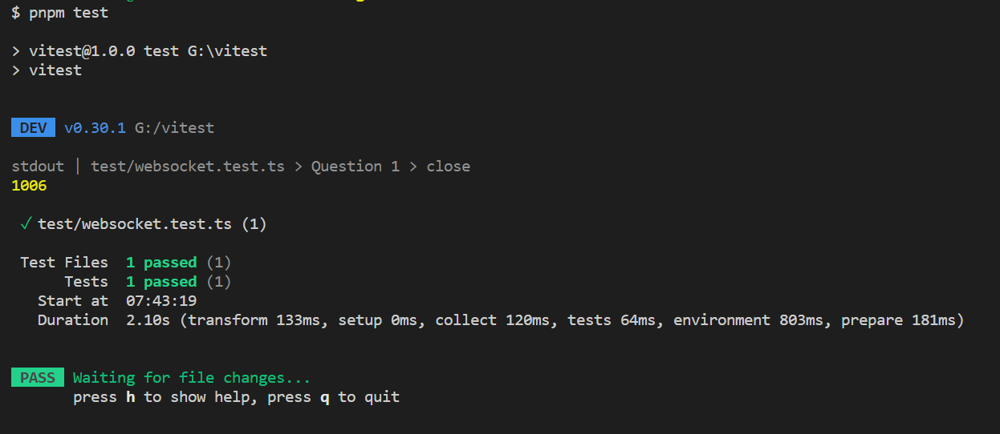
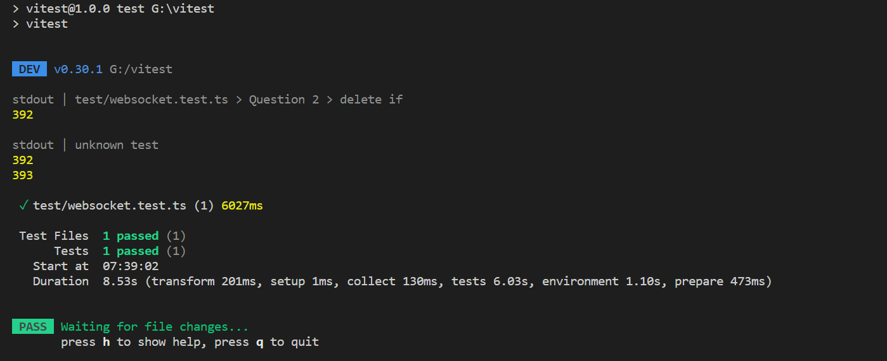
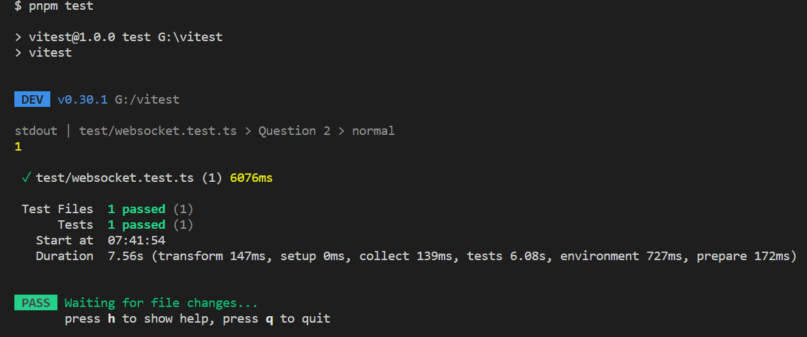
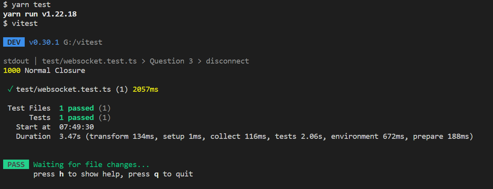

## 前言

在上一篇文章[借助ChatGPT我封装了WebSocket](https://zjgyb.github.io/views/js/2023/2023-04-11.html)中提出来两个疑问，那么答案是啥，这里可以使用`vitest`进行测试，先看结果然后再分析原因

## 环境准备

1. 安装依赖包`pnpm install typescript vitest jsdom ws @types/ws -D`
2. 利用`tsc --init`命令生成`tsconfig.json`
3. 配置`vitest.config.ts`

```ts
import { defineConfig } from 'vitest/config';

export default defineConfig({
  test: {
    environment: 'jsdom',
    include: ['./test/**.test.ts']
  },
});
```

## 测试案例

创建`test/websocket.test.ts`

### 问题1

```ts
// 直接this.websocket?.close();
import { it, describe, afterAll, beforeAll } from 'vitest';
import { WebSocketServer, Server } from 'ws';

import WebSocketClient, { WebSocketEventEnum } from '../index';

const port = 8080;

let wss: Server;

beforeAll(() => {
    return new Promise(resolve => {
        wss = new WebSocketServer({ port }, resolve);
    });
});

afterAll(() => {
    wss.close();
});

describe('Question 1', () => {
    it('close', async () => {
        const socket = new WebSocketClient(`ws://localhost:${port}`, {
            timeout: 10
        });
        await new Promise(resolve => {
            socket.on(WebSocketEventEnum.open, () => {
                resolve(true);
            });

            socket.on(WebSocketEventEnum.close, (event: CloseEvent) => {
                console.log(event.code, event.reason);
                resolve(true);
            });
        });
    });
});
```

结果


从图中可以看出只打印了`1006`同时并没有给出原因

假如手动加上状态码同时加上原因看测试结果

```ts
this.websocket?.close(3000, 'no reason');
```

发现与之前的**结果一致**

因此**答案**为：

1. 默认打印出的`code`是`1006`，`reason`为空字符串
2. 如果我在代码中手动赋值，那么打印出的`code`和`reason`与默认打印出的一致

### 问题2

1. 如果删除了if条件

```ts
// ...
const delay = (wait: number) => {
    return new Promise(resolve => {
        setTimeout(() => {
            resolve(true);
        }, wait);
    });
};

describe('Question 2', () => {
    it('delete if', async () => {
        const port = 9000;
        const socket = new WebSocketClient(`ws://localhost:${port}`, {
            reconnectionDelay: 100
        });
        let num = 0;
        await delay(5_000);
        await new Promise(resolve => {
            new WebSocketServer({ port });
            socket.on(WebSocketEventEnum.open, async () => {
                num++;
                await delay(1000);
                console.log(num);
                expect(num).toBeGreaterThan(1);
                resolve(true);
            });
        });
    }, 10_000);
});
```

结果：



1. 加上if条件

```ts
// ...
describe('Question 2', () => {
    it('normal', async () => {
        const port = 1000;
        const socket = new WebSocketClient(`ws://localhost:${port}`, {
            reconnectionDelay: 100
        });
        let num = 0;
        await delay(5_000);
        await new Promise(resolve => {
            new WebSocketServer({ port });
            socket.on(WebSocketEventEnum.open, async () => {
                num++;
                await delay(1_000);
                console.log(num);
                expect(num).toBe(1);
                resolve(true);
            });
        });
    }, 10_000);
});
```

结果：



## 原因

### 疑问1

在[RFC规范中](https://www.rfc-editor.org/rfc/rfc6455.html#section-7.1.5)有几个地方说明了`1006`出现的含义

> If the WebSocket Connection is Closed and no Close control frame was received by the endpoint (such as could occur if the underlying transport connection is lost), The WebSocket Connection Close Code is considered to be 1006

如果WebSocket连接关闭了并且没有收到终端的关闭控制帧（例如，如果底层传输连接丢失），WebSocket连接关闭码被视为1006

> 1006 | Abnormal Closure

1006 | 异常关闭

> 1006 is a reserved value and MUST NOT be set as a status code in a Close control frame by an endpoint. It is designated for use in applications expecting a status code to indicate that the connection was closed abnormally, e.g., without sending or receiving a Close control frame.

1006是一个保留值，终端在关闭控制帧中不能将其设置为状态码，该状态码被指定用于应用程序以表明连接异常关闭，例如，在未发送或接收关闭控制帧的情况下。

至于这个状态码为什么没有原因在[规范](https://www.rfc-editor.org/rfc/rfc6455.html#section-7.1.6)中也给出来了

> If there is no such data in the Close control frame, The WebSocket Connection Close Reason is the empty string.

如果在关闭控制帧没有数据，那么WebSocket连接关闭原因就是空数据

由上面的信息其实可以看出为什么第一个问题中的状态码为`1006`并且原因为空了，至于为什么设置原因还是`1006`，我猜测可能未连接情况下强制为1006这个状态码了，这个与规范一致，同时不会出现行为一致但状态码不一致问题

那么为什么在`disconnect`中又加上`code`和`reason`呢，因为手动调用`disconnect`一般都是在连接后，因此连接后在方法中加的参数是能够在函数中打印出来的

如下图所示：



### 疑问2

通过测试其实不难发现，在未连接服务器时存在超时时间，在使用代码进行关闭后`this.websocket?.close()`会触发`error`事件，然而这个时候服务器并没有关闭，即使`websocket`设置为`null`，但是没有移除事件，过了一段时间会触发`close`事件，因此造成多创建一次

解决方案：

1. 要么如前文提到的加上`if`判断，等服务器真正关闭后再重连
2. 注册事件的时候使用`addEventListener`进行注册，在`websocket`设置为`null`之前进行使用`removeEventListener`事件移除，那么原先创建的实例就不会触发注册的事件了

## 关联阅读

- [借助ChatGPT我封装了WebSocket](https://zjgyb.github.io/views/js/2023/2023-04-11.html)