## 前言

不知道有人是否与我一致，想到 `SSE` 脑海中的印象就是服务器能够向客户端推送消息，但客户端不能通过该方法返回消息，而有了 `WebSocket` 之后似乎就没有必要用到 `SSE` 了，那真的是这样吗？那就来一次知识盘点吧，看看它与 `WebSocket` 的差异！

## 介绍

`SSE` 是 `Server-Sent Events` 的简称，是一种允许服务器实时地将事件推送到客户端的技术，同时能够让客户端与服务器保持一个持久的 `HTTP` 连接。它是单项通信，只能从服务端发送到客户端。

有如下几个特点：
> 通过一个长连接低延迟交付
>
> 高效的浏览器消息解析，不会出现无限缓冲；
>
> 自动跟踪最后看到的消息及自动重新连接；
>
> 消息通知在客户端以 DOM 事件形式呈现。

## 建立 SSE

在客户端创建一个 `SSE` 应用程序也很简单，只需要简单的一行，例如：

```ts
const sse = new EventSource('/api/sse');
```

语法也就两个参数

```ts
new EventSource(url, options);
```

### url

远端服务器资源路径，该 `url` 参数值应该符合正常的 `http` 接口格式，那一个正常的连接是怎么样的内，如图所示：

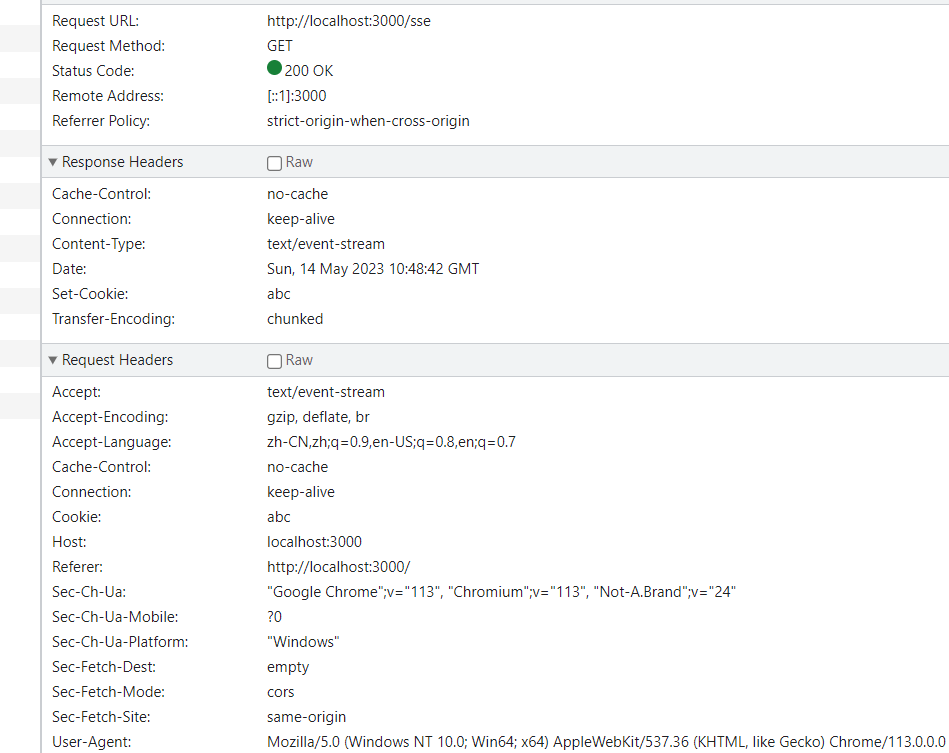

有几个疑问点**值得注意**

**说明**：下面如果没有特殊标明，一律使用 `Chrome` 进行测试

#### 疑问一

如果不使用当前的域名（**服务器相关接口开放**），会发生什么现象？

直接上图，如下图所示：

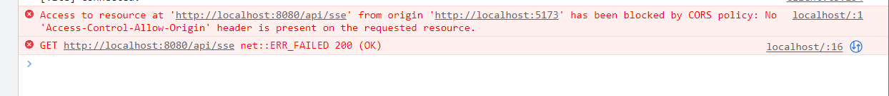

从图中可以发现，与使用 `AJAX` 请求在浏览器中表现一致，浏览器会提示存在跨域，连接失败

#### 疑问二

如果这个连接地址是错误的或者没有这个资源路径会有什么现象？

直接上图，如下图所示：

同域情况：
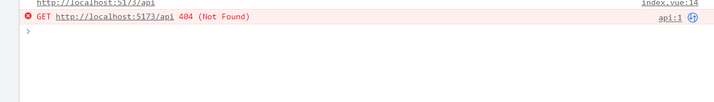

如果是找不到资源路径的情况下不会发生重连

跨域情况：
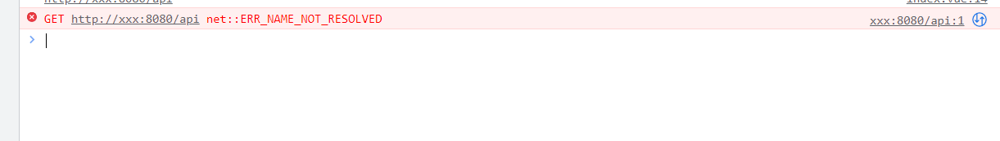

而在跨域情况下 `Chrome`、`Edge` 会发生自动重连现象，而 `Firfox` 则不会，这里我在自己的电脑上测试一下时间间隔是多大：

使用的测试代码为：
```ts
const sse = new EventSource('http://xxx:8080/api');
let timer = 0;
sse.addEventListener('error', () => {
    if (!timer) {
        timer = Date.now();
    } else {
        const newTimer = Date.now();
        console.log(newTimer - timer);
        timer = newTimer;
    }
});
```

1. `Chrome 版本 112.0.5615.138（正式版本）（64 位）`：`5s` 左右

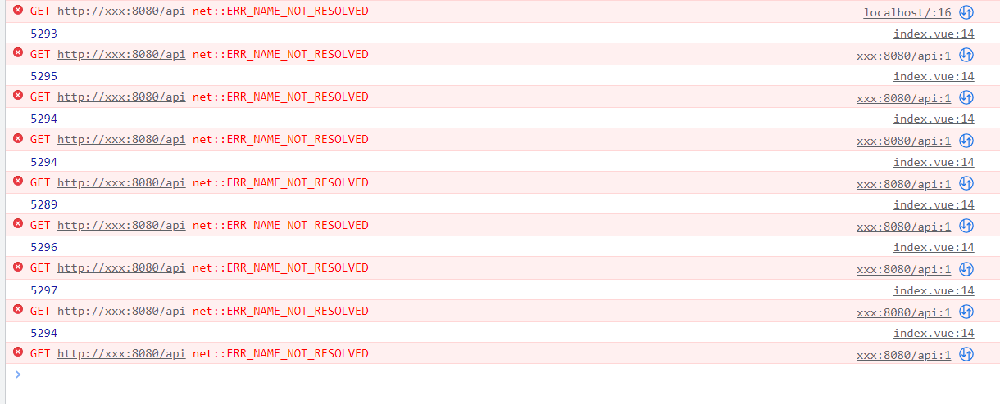

2. `Microsoft Edge版本 113.0.1774.35 (正式版本) (64 位)`：`5s` 左右

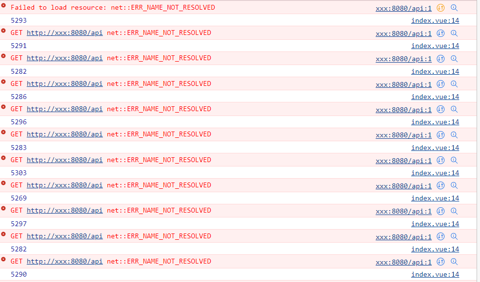

3. `FireFox 版本 113.0.1`：`firefox` 比较特殊，如果是同域，那么与 `chrome` 一致，如果是跨域，那么如下图所示，直接报错，不发生重连

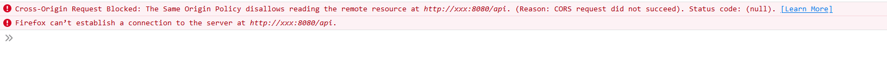

为什么会表现不一致呢？在规范中有这么一句话：

> When a user agent is to fail the connection, the user agent must queue a task which, if the readyState attribute is set to a value other than CLOSED, sets the readyState attribute to CLOSED and fires an event named error at the EventSource object. Once the user agent has failed the connection, it does not attempt to reconnect.

大致意思就是：当用户代理需要关闭连接时，用户代理必须排队执行一个任务，该任务在 `readyState` 属性设置为非 `CLOSED` 值时，将 `readyState` 属性设置为 `CLOSED`，并在 `EventSource` 对象上触发一个名为 `error` 的事件。一旦用户代理关闭了连接，它就不会尝试重新连接。

其实在 `error` 事件中打印 `readyState` 能够发现端倪，`Chrome` 的表现还是为 `0`，而 `FireFox` 则为 `2`，因此两者是否重连取决于对于连接失败的请求的状态是否设置为 `CLOSED` 有关

#### 疑问三

`SSE` 能够自动重连，那么这个时间是多少？是疑问二的 `5s` 吗？

规范是否有对这个重连时间进行定义呢？这里可以查看 [HTML规范](https://html.spec.whatwg.org/multipage/server-sent-events.html#sse-processing-model)

> A reconnection time, in milliseconds. This must initially be an implementation-defined value, probably in the region of a few seconds.

重连时间：以毫秒为单位。这最初必须是一个实现定义的值，可能在几秒钟内。

这句话意思是应当先设置一个由具体实现（例如浏览器或其他客户端）所定义的时间值，作为 `SSE` 重新连接的间隔。虽然此值会因不同实现而有所差别，但通常会在几秒钟的范围内，因此规范本身并没有确定默认的重连时间间隔是多少，而是将这个初始值留给具体实现（例如浏览器）来设定。

使用如下代码进行测试：

```js
// server.js
const express = require('express');
const SSE = require('sse');

const app = express();

app.get('/', (req, res) => {
   res.sendFile(__dirname + '/index.html');
});

const server = app.listen(3000, () => {
   console.log('Server listening on port 3000');
});

const sse = new SSE(server);

sse.on('connection', (client) => {
   console.log('Client connected');
   sendEvent(client, 1);

   client.on('close', () => {
     console.log('Client disconnected');
   });
});

function sendEvent(client, count) {
   client.send({ event: 'message', data: 'Sample data: ' + count });
   client.close();
}
```

```html
<!-- 主要代码 -->
<script>
   const source = new EventSource('/sse');
   let timer = 0;

   source.addEventListener('message', (event) => {
      const div = document.createElement('div');
      div.textContent = event.data;
      document.body.appendChild(div);
   });

   source.addEventListener('error', () => {
      if (!timer) {
          timer = Date.now();
      } else {
          const newTimer = Date.now();
          console.log(newTimer - timer);
          timer = newTimer;
      }
   });
</script>
```

1. `Chrome`: `3s` 左右
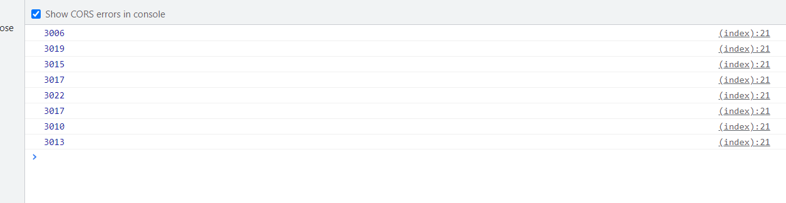
2. `FireFox`: `5s` 左右
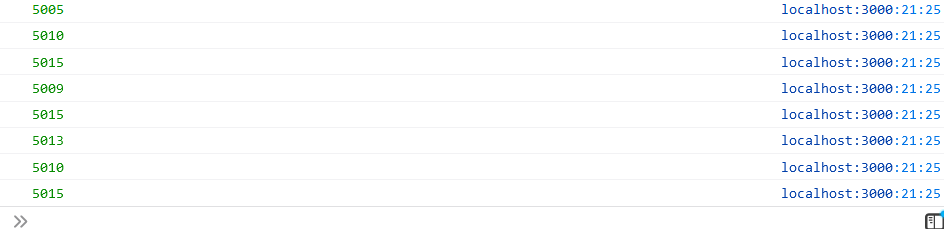

因此：`Chrome` 重连时间存在两种情况

### options

连接的配置项，目前只有一个配置项 `withCredentials`

#### withCredentials

布尔值，默认为 `false`，表示在跨域时是否携带凭证（credentials）

因此这个值需要在跨域的时候才需要设置

未设置时：
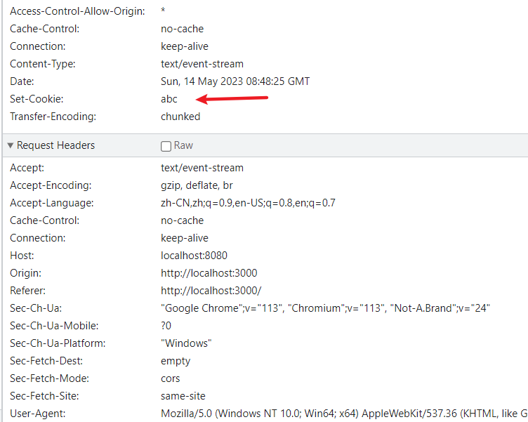

设置这个属性后
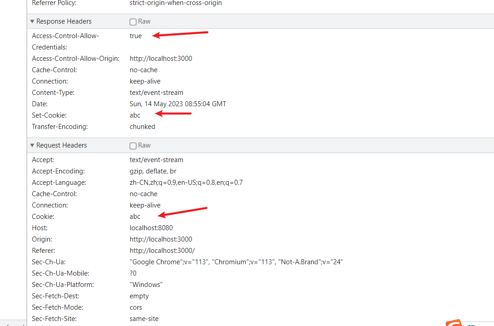

## 实例属性

### readyState

当前 `SSE` 的连接状态

- 0(EventSource.CONNECTING): 连接中
- 1(EventSource.OPEN): 已连接
- 2(EventSource.CLOSED): 已关闭

```js
const source = new EventSource('/sse');

source.addEventListener('open', () => {
    console.log(source.readyState); // 1
});
```

### url

创建 `SSE` 实例对象的 `URL`，**注意**这个返回的 `url` 如果是同域时会自动补充前面的域名，如果是默认端口号也会隐藏掉，例如：

1. 自动补全
```js
const source = new EventSource('sse');

source.addEventListener('open', () => {
    console.log(source.url); // http://localhost:3000/sse
});
```
2. 默认端口不显示
```js
const source = new EventSource('http://localhost:80/sse', {
   withCredentials: true
});

source.addEventListener('open', () => {
   console.log(source.url); // http://localhost/sse
});
```

### withCredentials

是否携带凭证，这个在 `new` 一个对象时第二个参数配置相关，默认为 `false`

```js
const source = new EventSource('http://localhost:80/sse', {
   withCredentials: true
});

source.addEventListener('open', () => {
   console.log(source.withCredentials);
});
```

## 实例方法

### close

关闭 `SSE`，与 `WebSocket` 不同的是，这个实例方法不需要传递任何参数

```ts
const source = new EventSource('sse');

source.addEventListener('open', () => {
   source.close();
});
```

## 事件

和其他事件一致，有两种声明方式

```js
addEventListener('open', (event) => {});

onopen = (event) => {};
```

### open

当 `SSE` 处于 `open` 状态，即 `readyState` 为 `1` 时触发

该打开事件参数为普通的 [Event](https://developer.mozilla.org/en-US/docs/Web/API/Event)

### message

当 `SSE` 接收到消息时触发并且消息类型为 `message`

这个消息事件参数与 `WebSocket` 中 `message` 一致，可以看另一个篇文章[WebSocket知识盘点](https://juejin.cn/post/7228831981889634363#heading-25)中的介绍

依次打印出的结果：
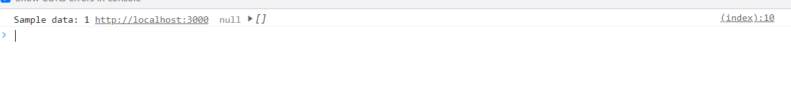

这里需要着重介绍一下 `lastEventId`

这个字段是用来标识返回的消息，如果在某一刻浏览器与服务器之间的服务断开了，那么在重新连接后浏览器会把断开前最后一个消息标识传递给服务器，例如

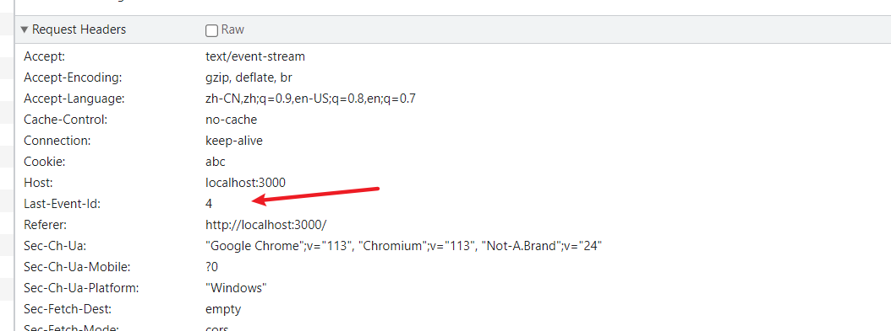

如果一开始设置了标识 `2`，但是后面的消息没有设置标识了，那么如果这个时候断开重连，那这个`lastEventId`是什么呢？

经过测试发现，后面没有设置的标识默认会是最后设置的那一个标识，也就是 `2`，因此重连时 `lastEventId` 也为 `2`

### error

当 `SSE` 发生了一些异常导致不能正常连接时触发

该关闭事件参数为普通的 [Event](https://developer.mozilla.org/en-US/docs/Web/API/Event)

### 自定义事件

`SSE` 支持自定义事件，只要服务器设置了相应的事件类型，那么 `SSE` 支持设置自定义事件

```js
// server.js
client.send({ event: 'update' });

// 原生
res.write('event: update\n')
```

```js
// browser
const source = new EventSource('sse');
source.addEventListener('update', (e) => {
   console.log(e.data);
});
```

## 其他

后端返回给前端的消息一共存在四个键值对，`event`、`data`、`id`、`retry`，例如 `Node` 中：

```js
res.write('event: update\n')
res.write('data: test\n')
res.write('id: 1\n')
res.write('retry: 8000\n')
```

前三个其实已经介绍过了，这里着重介绍 `retry`

### retry

这个字段用于设置重连时间，正如之前疑问三中所说，规范自定义了模糊的几秒，具体实现不同浏览器可能存在差异，因此如果加了这个字段后，那么重连时间能够做到一致

```js
res.write('retry: 8000\n')
```

## 差异总结

以下是 `SSE` 与 `WebSocket` 的差异总结

### 不同点

1. `SSE` 利用的是 `HTTP` 连接，因此使用的协议也就是 `HTTP`，而 `WebSocket` 主要（仍然要经历 `HTTP` 阶段，需要经历一次握手）使用的是自己的协议
2. `SSE` 是一次性的单工传输，只能从服务端发送到客户端，而 `WebSocket` 是可复用的全双工传输，客户端和服务端都可以发送消息给对方
3. `SSE` 与 `WebSocket` 都存在实例方法 `close`，但 `WebSokcet` 由于是双向通信，多了一个 `send` 实例方法
4. `SSE` 具备断开重连机制，而 `WebSocket` 没有
5. `SSE` 实例调用 `close` 方法没有参数，不可以配置，而 `WebSocket` 可以配置参数
6. `SSE` 支持自定义事件，而 `WebSocket` 不支持
7. `SSE` 没有 `close` 事件能够被监听，而 `WebSocket` 可以通过 `addEventListener` 可以监听到
8. `SSE` 服务器响应的格式为 `text/event-stream`，返回的内容只为 `string`，而 `WebSocket` 返回的格式有多种，`string`、`blob`...
9. `SSE` 直接利用 `cookie` 来实现权限控制的效果，`WebSocket` 权限控制需要另外设置
10. `SSE` 无法选择要发送的对象，而 `WebSocket` 可以通过控制逻辑实现选择性发送，进而实现多播和广播

### 相同点

1. 实例属性获取 `url` 返回的规则相同
2. 都存在实例方法 `close`，同样存在 `open`、`error`事件

## 参考文章

- [MDN](https://developer.mozilla.org/en-US/docs/Web/API/EventSource)
- [《High Performance Browser Networking》](https://hpbn.co/server-sent-events-sse/)
- [HTML SSE规范](https://html.spec.whatwg.org/multipage/server-sent-events.html)

## 关联阅读

- [借助ChatGPT我封装了WebSocket](https://juejin.cn/post/7220776393373450296)
- [WebSocket疑问解答](https://juejin.cn/post/7222186286563672119)
- [WebSocket知识盘点](https://juejin.cn/post/7228831981889634363)