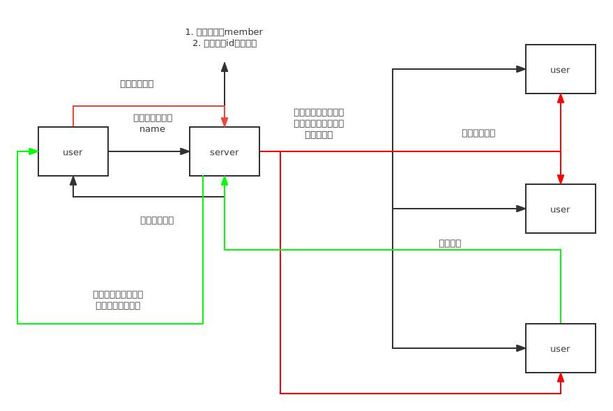

## 前言

看一个聊天的简单逻辑



对应代码：

```ts
// index.ts
import type {
  ServerToClientEvents,
  ClientToServerEvents,
  InterServerEvents,
  SocketData,
} from './src/types';
import * as express from 'express';
import * as http from 'http';
import { Server } from 'socket.io';
import socketFn from './src/socket';

const app = express();
const server = http.createServer(app);
const io = new Server<
  ClientToServerEvents,
  ServerToClientEvents,
  InterServerEvents,
  SocketData
>(server, {
  cors: {
    origin: ['http://localhost:8000'],
    credentials: true,
  },
});
socketFn(io);

server.listen(3000, () => {
  console.log('listening on *:3000');
});
```

```ts
// types.ts
import type { Server } from 'socket.io';

export interface ServerToClientEvents {
  join: (name: string) => void;
  message: (msg: string) => void;
}

export interface ClientToServerEvents {
  join: (member: number, name: string) => void;
  leave: (member: number, name: string) => void;
  receive: (msg: string, user: string) => void;
}

export interface InterServerEvents {}

export interface SocketData {}

export type SocketIo = Server<
  ServerToClientEvents,
  ClientToServerEvents,
  InterServerEvents,
  SocketData
>;
```

```ts
// socket.ts
import { SocketIo } from './types';

export default function (io: SocketIo) {
  // 成员个数
  let member = 0;

  // 用户名
  let socketMap: Record<string, string> = {};

  io.on('connection', (socket) => {
    let id = socket.id;

    // 加入群聊
    socket.on('join', (name) => {
        socketMap[id] = name;
        member++;

        // 广播给他人
        socket.broadcast.emit('join', member, name);

        // 广播当前用户
        socket.emit('join', member, name);
    });

    // 发送消息
    socket.on('message', (msg: string) => {
        // 广播给其他成员
        socket.broadcast.emit('receive', msg, socketMap[id]);
    });

    // 离开时退出群聊
    socket.on('disconnect', () => {
        member--;

        // 广播出去
        socket.broadcast.emit('leave', member, socketMap[id]);
        delete socketMap[id];
    });
  });
}
```

## 路由搭建

**注意**，这里设置500未生效，因此之后如果找到方案，那么需要修改一下

```ts
// router/index.ts
import type { Express, ErrorRequestHandler } from 'express';

const router = (app: Express) => {
    // 设置跨域访问，允许所有端口访问
    app.all('*', (req, res, next) => {
        //设置允许跨域的域名，*代表允许任意域名跨域
        res.header('Access-Control-Allow-Origin', '*');
        //允许的header类型
        res.header('Access-Control-Allow-Headers', 'content-type');

        if (req.method.toLowerCase() == 'options') {
            res.send(200);
            return
        }

        next();
    });

    app.get('/', (req, res) => {
        res.send('首页');
    });

    // 测试
    app.get('/test', (req, res) => {
        res.send('测试');
    });

    // 处理404
    app.use((req, res) => {
        res.status(404).send('Not found');
    });

    // 处理500，但未生效
    const errorFn: ErrorRequestHandler = (err, req, res) => {
        res.status(500).send('xxx');
    };

    app.use(errorFn);
};

export default router;
```

## 连接数据库

在连接之前需要安装`mongodb`以及安装`mongoose`包

```ts
// 连接文件
// config/db.ts
// 连接数据库
import mongoose from 'mongoose';

const db = mongoose.createConnection('mongodb://localhost:27017/admin');

db.on('error', () => {
    console.log('connection error');
});

db.on('open', () => {
    console.info('数据库连接成功');
});

export default db;
```

```ts
// model/db.ts
// 连接到具体的model

import { Schema } from 'mongoose';
import db from '../config/db';

const userSchema = new Schema();
const User = db.model('user1', userSchema);

export default User;
```

```ts
// controller/db.ts
// 向外提供查询接口
import type { Response } from 'express';
import dbmodel from '../model/db';

export const findUser = (res: Response) => {
    dbmodel.find((err, val) => {
        if (err) {
            console.log('数据查找失败' + err);
            return;
        }

        res.send(val);
    });
};
```

## 发送邮箱

安装`nodemailer`（必选）和`body-parser`（可选）

```ts
// controller/email.ts
import * as nodemailer from 'nodemailer';

export const sendEmail = async (mail: string) => {
    const testAccount = await nodemailer.createTestAccount();

    const transporter = nodemailer.createTransport({
        host: 'smtp.ethereal.email',
        port: 587,
        secure: false,
        auth: {
            user: testAccount.user,
            pass: testAccount.pass,
        },
    });

    const info = await transporter.sendMail({
        from: testAccount.user,
        to: 'xxx@xxx.com',
        text: '测试',
        html: '<b>Hello world?</b>', // html body
    });

    console.log('发送邮箱成功' + info.messageId + mail);
    return true;
};
```

```ts
// router/index.ts
import { sendEmail } from '../controller/email';

const router = (app: Express) => {
    // ...
    app.post('/test', async (req, res, next) => {
        const email = req.body.email;
        const result = await sendEmail(email).catch(err => {
            next(err)
        });
        res.send({ success: !!result });
    });
    // ...
};

// ...
```

入口配置

```ts
// 为了支持req.body
import * as bodyParser from 'body-parser';
app.use(bodyParser.json());
app.use(bodyParser.urlencoded({ extended: true }));
```

或者直接

```ts
app.use(express.json());
app.use(express.urlencoded({ extended: false }));
```

## 参考来源

- [B站](https://www.bilibili.com/video/BV1uz4y1D75z)